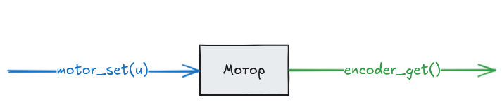
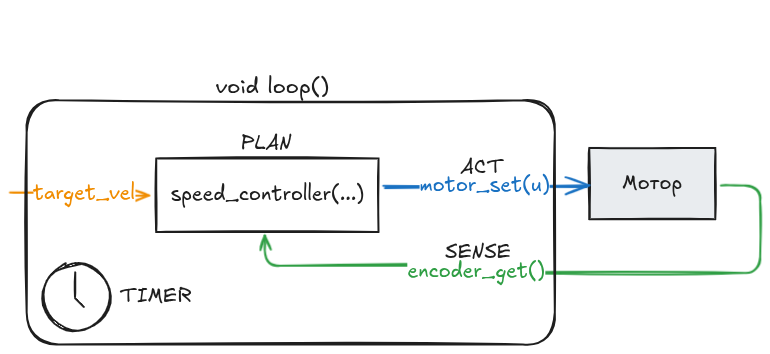
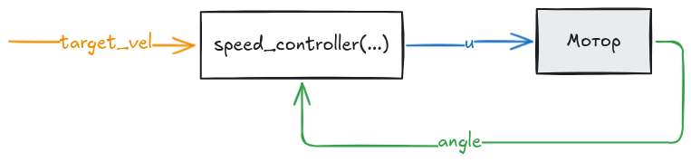
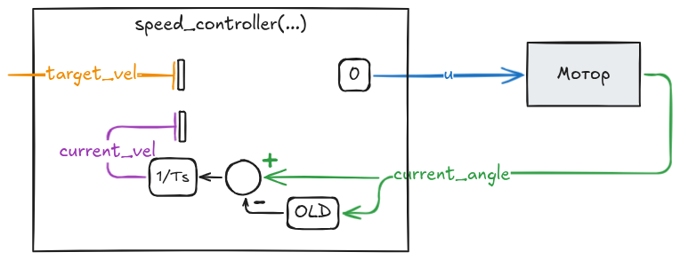
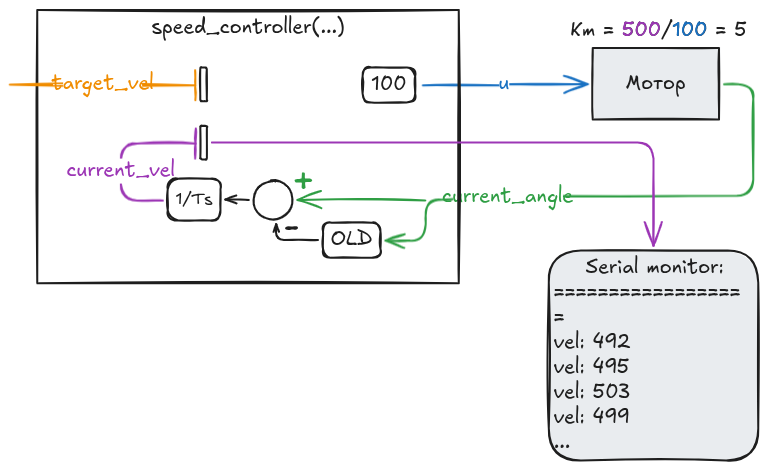
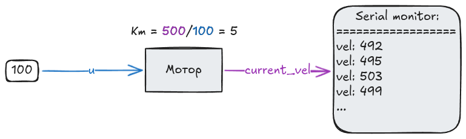

# Настройка регулятора скорости на моторе постоянного тока

## 1. Написание драйверов мотора и энкодера

Прежде чем переходить к настройке регулятора скорости необходимо написать функции взаимодействия с нашим мотором. Предположим, что они называются у нас следующим образом:

```c
// Выдача управления на мотор
void motor_set(float u);

// Чтение энкодера
float encoder_get();
```

Внутри этих функций будет происходить вся работа с ШИМом, прерываниями и всеми подобными штуками. Мы же об этом думать не думаем и будем работать с мотором как с коробкой, в которую мы можем подать некоторые данные на вход (управляющее воздействие) и прочитать какие-то выходные данные (угол поворота энкодера):



### Требования к драйверам мотора и энкодера

1. Драйвер мотора принимает значения разного знака. Изменение знака изменяет направление вращения мотора.
2. Драйвер энкодера определяет угловое перемещение мотора, а не его путь. Поворот мотора в одну сторону должне значение энкодера увеличивать, а в другую — уменьшать.

Это связано с тем, что нам важно знать не только модуль величины (напряжения на моторе и его угол поворота), но и его _знак_.

## 2. Создание главного цикла

Для надежной работы регуляторов критически важно иметь быстрый и неблокирующий цикл с постоянным временем выполнения. Это обеспечивает стабильность настроек регулятора.

Допустим, у нас один единственный мотор и `void loop()` находится в нашем полном распоряжении. Выглядеть он будет примерно так:

```c
void loop() {
    // TIMER
    smart_delay(5);

    // SENSE
    float current_angle = encoder_get();

    // PLAN
    float u = speed_controller(target_vel, current_angle);

    // ACT
    motor_set(u);
}
```

Цикл разделен на 4 области, согласно идеологии ITSPA:
1. **T**IMER - обеспечение постоянного времени выполнения цикла
2. **S**ENSE - чтение данных с датчиков
3. **P**LAN - расчет управляющих воздействий на итерацию
4. **A**CT - выполнение управляющих воздействий на мотор

Теперь нашу систему можно нарисовать следующим образом:



Мотор на схеме изображен серым цветом, поскольку эта часть нашей системы неизменяема. Все что мы пишем сами изображено белым цветом.

Однако такую схему рисовать громоздко, поэтому мы ее преобразуем так:



Что изменилось?

Каждая стрелочка обозначает какой-либо **сигнал** в нашей системе. Его название написано на самой стрелочке. Наша задача - реализвать блок `speed_controller` так, чтобы мотор в реальном мире крутился со скорость `target_vel`.

## 3. Вычисление скорости вращения мотора

Первая задача которая перед нами стоит - найти скорость вращения нашего мотора.

```cpp
float speed_controller(float target_vel, float current_angle)
{
    // Вычисление скорости вращения мотора
    static float old_angle = 0;

    float delta_angle = current_angle - old_angle;
    float delta_time = Ts_s;

    float current_vel = delta_angle / delta_time;

    old_angle = current_angle;

    ///////
    //...//
    ///////

    return 0;
}
```



## 4. Измерение характеристик мотора

С использованием полученной скорости мы осуществим один из важнейших экспериментов, необходимых для настройки регулятора скорости мотора.

### Измерение коэффициента усиления

Первое - нам необходимо подать на мотор какое-то постоянное управляющее воздействие и узнать его вычисленную скорость. Если мы поделим скорость на входное воздействие, мы получим **коэффициент усиления** нашего мотора $K_m$.

```diff
float speed_controller(float target_vel, float current_angle)
{
    // Вычисление скорости вращения мотора
    static float old_angle = 0;

    float delta_angle = current_angle - old_angle;
    float delta_time = Ts_s;

    float current_vel = delta_angle / delta_time;

    old_angle = current_angle;
    ////

+    Serial.print("vel: ");
+    Serial.println(current_vel);

    ///////
    //...//
    ///////

-    return 0;
+    return 100;
}
```





Пусть для нашего гипотетического мотора получился $K_m = 5$. Это значит, что измеренная скорость вращения будет в 5 раз больше, чем поданное ему на вход значение. Например, как в эксперименте, мы подали на вход значение $100$ (допустим ШИМ), и измеренная скорость была равна $100 * 5 = 500$ попугаев в секунду.

### Оценка большой постоянной времени

Второе - нам необходимо оценить насколько долго мотор разгоняется до установившейся скорости. Самый простой способ это сделать - на слух.

Мы выключаем мотор. Потом резко его включаем (например снимаем питание и снова подаем) и слушаем его звук. Он будет некоторое время изменятся в высоте, после чего остановится и будет гудеть неизменно.

Нам необходимо определить это время и запомнить его. Это будет наша **большая постоянная времени**, обозначаемая как $T_m$.

Ниже приведены примерные звуки разгона двигателя с разными постоянными времени, от 0.1с до 1с.

$T_m = 0.1s$

<video controls width="300" height="50">
      <source src="sound/T01s.wav" type="audio/wav">
</video>

---

$T_m = 0.2s$

<video controls width="300" height="50">
      <source src="sound/T02s.wav" type="audio/wav">
</video>

---

$T_m = 0.3s$

<video controls width="300" height="50">
      <source src="sound/T03s.wav" type="audio/wav">
</video>

---

$T_m = 0.5s$

<video controls width="300" height="50">
      <source src="sound/T05s.wav" type="audio/wav">
</video>

---

$T_m = 1.0s$

<video controls width="300" height="50">
      <source src="sound/T1s.wav" type="audio/wav">
</video>

### Оценка малой постоянной времени

Наши микроконтроллеры имеют неизбежную задержку в обработке данных, выдаче управления, вызванную тем, что они работают в цикле с фиксированным временем выполнения. Быстрее времени одной итерации цикла МК отреагировать на изменения окружающей среды не может.
Это минимальное время реакции робота на изменение окружающей среды мы будем называть **малой постоянной времени** и обозначать как $T_\mu$


## 5. Настройка регулятора скорости на моторе постоянного тока
