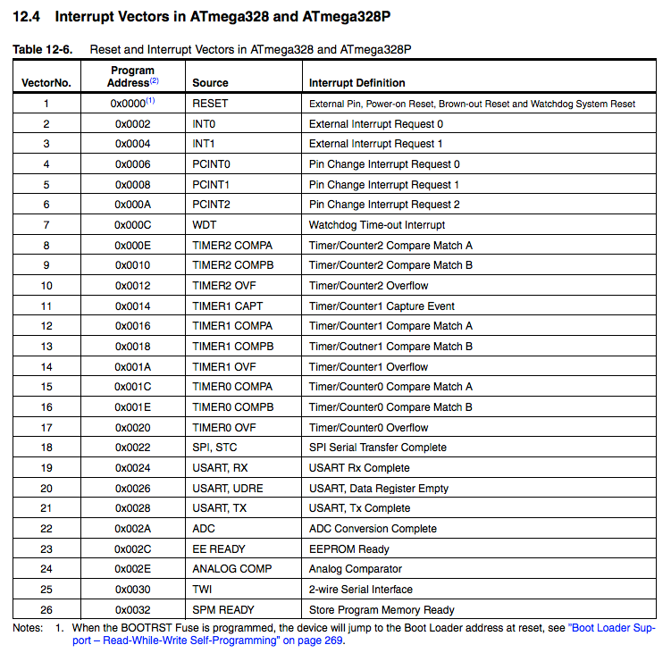
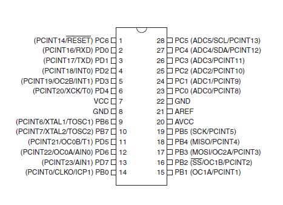

# Настройка прерываний PIN CHANGE INTERRUPT

> Оригинальный урок: https://thewanderingengineer.com/2014/08/11/arduino-pin-change-interrupts/
>
> Ниже представлен его частичный перевод с проекцией собственного опыта

Недавно мне пришлось по воле жизни использовать в работе Pin Change Interrupts, и это было интересной задачкой. Как оказалось, их использовать достаточно несложно. Публикую данную статью с целью сохнанения для себя если потребуется найти эту информацию в будущем.
Также может быть это поможет кому-нибудь другому.

Разговор будет идти конкретно о микроконтроллере Atmega328p, так как он является самым распростаненным в любительской робототехнике и в моем окружении, однако эта информация должна легко проецироваться также на другие микроконтроллеры семейства AVR. Для начала, определимся с терминологией. Существует прерывания, генерируемые внешними сигналами (External Interrupt, Pin Change Interrupt) и генерируемые внутренней периферией, такой как таймеры и компараторы.

Среди прерываний внешними сигналами есть два типа: External Interrupts и Pin Change Interrupts. Название здесь чуть вводит в заблуждение, ибо оба типа прерываний приходят снаружи микроконтроллера. Однако важным моментом здесь является то, что прерывания ExtINT можно использовать на очень ограниченном количестве пинов, тогда как PCINT можно использовать на ВСЕХ пинах микроконтроллера. Например на Arduino UNO (Atmega328p) есть всего 2 прерывания ExtINT, но целых 24 прерывания PCINT.

Каждый раз когда происходит прерывание оно вызывает соответствующий обработчик ISR (Interrupt Service Routine), если это прерывание было активировано. Каждое внешнее прерывание (ExtINT) имеет собственный обработчик и они могут срабатывать независимо по переднему, заднему или обоим фронтам сигнала. Однако прерывания по изменению пина (PCINT) имеют один обработчик на все пины внутри одного порта (порт B, C и D). И каждый раз, когда внутри порта пин изменяет свое состояние, вызывается обработчик, который должен сам определить какой пин вызвал это прерывание. Как следствие PCIN сложнее использовать чем ExtINT, однако могут быть использованы на абсолютно любых пинах. 



Прерывания ExtINT также проще использовать в окружении Arduino. Их можно использовать одним вызовом функции `attachInterrupt()`, передав номер прерывания и функцию обработчик. Однако до сих пор не было удобной библиотеки для работы с PCINT, а те которые есть не являются стандартом и их необходимо устанавливать и подключать отдельно. Однако, я считаю, что нет необходимости использовать библиотеки для решения задач, которые можно решить буквально парой строчек кода. Как будто-бы такой код проще отлаживать и понимать что происходит. По этой причине, код ниже использует команды AVR C и является универсальным. Его можно использовать и с Arduino и на чистом Си.



Для включения этих прерываний необходимо выполнить три действия:
1) Включить прерывания по изменению пина
2) Выбрать, на каких портах и пинах выполнять прерывания
3) Реализовать обработчик ISR для нужных портов

## 1. Включение прерываний

Для включения PCINT необходимо выставить определенные биты в регистре PCICR (Pin Chane Interrupt Control Register). Бит 0 включает PCINT на порту B (PCINT0-PCINT7), бит 1 включает на порту C (PCINT8-PCINT14), и бит 2 включает на порту D (PCINT16-PCINT23). Код ниже показывает как можно включить некоторые комбинации. Обратите внимание, используется не присвоение `'='`, а побитовое ИЛИ: `'|='`, т.к. мы как правило не хотим перезаписывать все биты, однако в нашем случае можно использовать и то и то. Кроме двоичного представления чисел можно также использовать шестнадцатиричное или десятичное. Однако в данном случае двоичное воспринимать проще.

```C++
PCICR |= 0b00000001;    // Включить на порту B
PCICR |= 0b00000010;    // Включить на порту C
PCICR |= 0b00000100;    // Включить на порту D
PCICR |= 0b00000111;    // Включить на всех портах
```


## 2. Выбираем нужные пины

Помимо включения прерываний для целого порта, необходимо также включить нужные пины внутри этого порта. Для этого используется несколько специальных регистров-масок. Так как на Atmega328 портов всего три, регистров-масок тоже три: PCMSK0, PCMSK1 и PCMSK2. Их можно модифицировать также как мы модифицировали регистр PCICR. Можно использовать и `'='` и `'|='`, однако последний вариант позволяет разделить выставление битов на несколько строчек без перезатирания уже выставленных битов.


```C++
PCMSK0 |= 0b00000001; // Включить пин PB0 (PCINT0), пин 8 на Arduino
PCMSK1 |= 0b00010000; // Включить пин PC4 (PCINT12), пин A4 на Arduino
PCMSK2 |= 0b10000001; // Включить пины PD0 и PD7 (PCINT16 и PCINT23), пины 0 и 7 на Arduino
```

## 3. Пишем обработчик прерывания ISR

Последним шагом будет написание функции-обработчика, которая будет вызываться при срабатывании прерывания. Общие соображения при написании подобной функции: сделать ее как можно короче и быстрее и не использовать внутри задержки. Также необходимо использовать корректное написание и капитализацию. Также, если внутри прерывания происходит работа с глобальными переменными необходимо их объявить как `volatile`. Это говорит компилятору что переменная может измениться в любой момент и ее необходимо каждый раз читать и не следует оптимизировать. Для объявления функции их следует объявить так:

```c++
ISR(PCINT0_vect){}    // Port B, PCINT0 - PCINT7
ISR(PCINT1_vect){}    // Port C, PCINT8 - PCINT14
ISR(PCINT2_vect){}    // Port D, PCINT16 - PCINT23
```

## Объединяем все вместе

Ниже приведен пример кода, который объединяет все описанное выше. Вы можете заметить, что перед настройкой конфигурации прерываний используется команда `cli()` (чтобы их отключить во избежание случайных срабатываний), и команда `sei()` после (чтобы их обратно активировать). Также можно заметить включение `avr/interrupt.h` наверху программы.

```c++
#include <avr/interrupt.h>

volatile int value = 0;

void setup()
{
    cli();
    PCICR |= 0b00000011; // Включаем прерывания Pin Change Interrupts на портах B and C
    PCMSK0 |= 0b00000001; // PCINT0
    PCMSK1 |= 0b00001000; // PCINT11
    sei();

    Serial.begin(9600);
}

void loop()
{
    Serial.println(value);
}

ISR(PCINT0_vect)
{
    value++;
}

ISR(PCINT1_vect)
{
    value–;
}
```